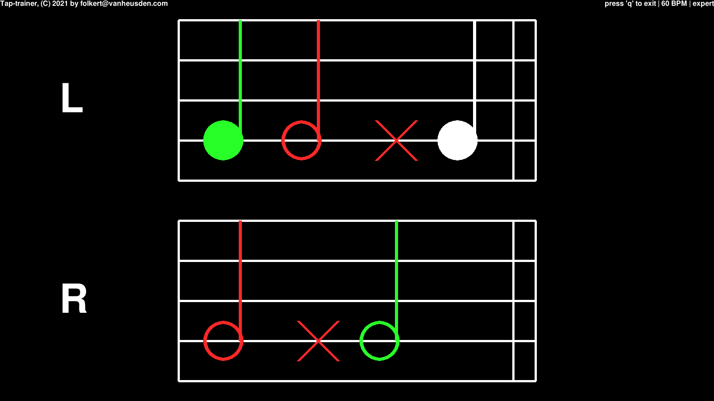

what is it
----------
This program helps you train coordination and rhythms in piano or keyboard practice.

installation
------------
Requires python3-pygame to be installed.

usage
-----
Press 'z' when a note is to be played for the left hand,
and '/' for the right hand.

Press 'e' to toggle between beginner- and expert mode.

Press '+' and '-' to change the BPM (beats per minute).

screenshot
----------

(C) 2021 by Folkert van Heusden <mail@vanheusden.com>
License: GPL v3.0
